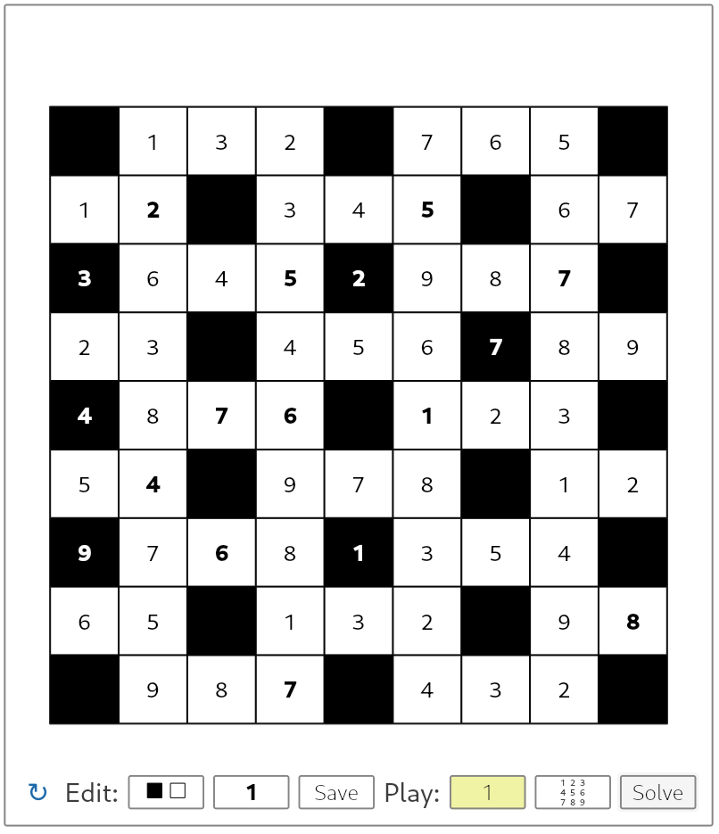

# SixtyFPS-Str8ts Demo
This demo shows an implementation of the [Str8ts puzzle](https://en.wikipedia.org/wiki/Str8ts) in the SixtyFPS GUI framework. The GUI is written in the .60 language, and the backend is written in Rust.

The demo is based on the official Slide Puzzle demo: [https://github.com/sixtyfpsui/sixtyfps/tree/master/examples/slide_puzzle](https://github.com/sixtyfpsui/sixtyfps/tree/master/examples/slide_puzzle)

### Functionality
- entering puzzles

- playing the puzzle: entering numbers, entering small numbers

- highlights numbers that violate the game rules

- solving the puzzle automatically

- animations when cells change color and when completing the puzzle

### Web version
The app can be cross-compiled to WebAssembly to run in the browser. This doesn't work perfectly at the moment, e.g. there are some problems with font handling. Also a physical keyboard is required, so the game can't be played on mobile devices.
